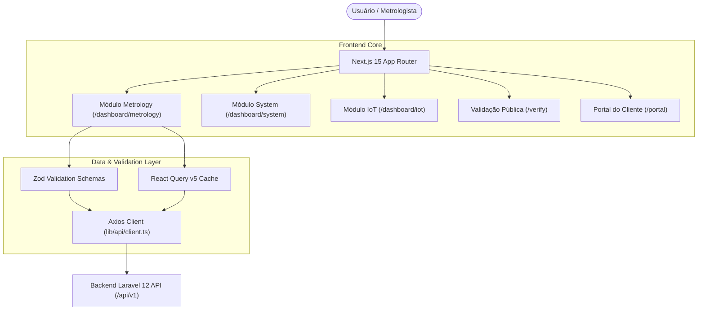
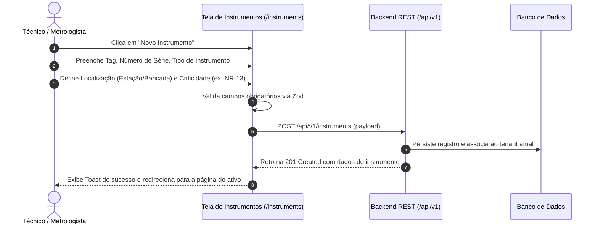
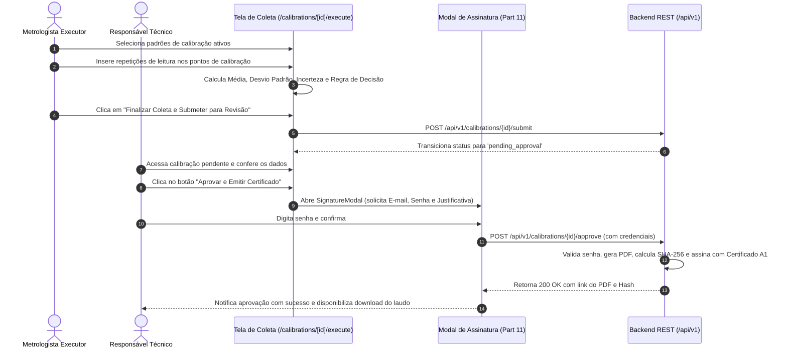

# Manual de Interface e Telas do Sistema Lean Tech Metrologia
**Código do Documento:** MAN-MET-005  
**Revisão:** 1.0  
**Data de Aprovação:** Outubro/2026  
**Normas de Referência:** ISO/IEC 17025:2017 (§7.11 - Controle de Dados e Gestão da Informação), FDA 21 CFR Part 11 (Registros e Assinaturas Eletrônicas), GAMP 5 (Validação de Sistemas Computadorizados).

---

## 1. Objetivo e Escopo

Este manual estabelece a documentação funcional, estrutural e operacional da interface de usuário (*Frontend Web*) do sistema **Lean Tech Metrologia (MetroLab)**. 

O objetivo é fornecer um guia de referência para treinamento operacional de metrologistas, auditores da qualidade e administradores de sistema, descrevendo detalhadamente:
1. O propósito, campos e comportamentos de cada tela do sistema.
2. A matriz de permissões e controle de acesso baseado em papéis (RBAC).
3. Os fluxos de trabalho metrológicos guiados (onboarding de ativos, calibração, checagem intermediária e recall).
4. As validações de segurança e conformidade estrita com a **ISO/IEC 17025:2017** e **FDA 21 CFR Part 11**.

---

## 2. Arquitetura de Interface e Padrões Tecnológicos

A aplicação frontend é estruturada sob os seguintes pilares de engenharia:
- **Framework:** Next.js 15 (App Router com layouts aninhados e Server/Client Components segregados).
- **Estilização e Design System:** Tailwind CSS v4 com tokens de cores semânticos baseados no Radix UI / Shadcn UI.
- **Gerenciamento de Estado de Servidor:** TanStack React Query v5 com invalidação seletiva de cache (`queryClient.invalidateQueries`).
- **Validação de Formulários:** Zod integrado ao React Hook Form, garantindo tipagem estrita de payloads e validação de limites antes da submissão à API REST.
- **Visualização de Dados Metrológicos:** Recharts para renderização de cartas de controle estatístico de Shewhart (LSC, LC, LIC) e gráficos de telemetria ambiental.
- **Internacionalização (i18n):** Suporte nativo a múltiplos idiomas com roteamento por locale (`app/[locale]/`).

---

## 3. Matriz de Perfis e Permissões de Acesso (RBAC)

O controle de visibilidade de menus, botões de ação e rotas no frontend é governado pelo token JWT e pelos papéis (*Roles*) atribuídos ao usuário logado:

| Perfil | Sigla | Descrição e Atribuições Operacionais | Telas Habilitadas |
| :--- | :---: | :--- | :--- |
| **Administrador Geral** | `admin` | Gestão de tenants, faturamento, configurações corporativas, usuários e certificado A1. | Todas as telas dos módulos Metrology, System e IoT. |
| **Responsável Técnico (RT)** | `tech_manager` | Metrologista sênior autorizado a assinar digitalmente e liberar laudos metrológicos (ISO 17025 §6.2). | Módulo Metrology completo, aprovação final de certificados, gestão de competências. |
| **Metrologista / Técnico** | `metrologist` | Coleta de dados experimentais, execução de calibrações, checagens intermediárias e apontamento de RNC. | `/instruments`, `/calibrations` (edição), `/standards`, `/work-orders`. |
| **Operador de Fábrica** | `operator` | Consulta de instrumentos, solicitação de serviços de calibração e movimentação física de bancada. | `/instruments` (somente leitura), `/work-orders` (abertura), `/portal`. |
| **Auditor da Qualidade** | `auditor` | Acesso de auditoria forense, inspeção da cadeia imutável de logs e relatórios de rastreabilidade. | `/audit-logs`, `/calibrations` (leitura), `/standards` (análise de impacto). |
| **Cliente B2B** | `client` | Cliente externo que contratou serviços do laboratório de metrologia. | Exclusivo ao subdomínio/rota `/portal/` (seus instrumentos e laudos). |

---

## 4. Sitemap Operacional e Dicionário de Telas

### 4.1 Módulo Metrology (`/dashboard/metrology/`)

#### 4.1.1 Inventário de Instrumentos (`/dashboard/metrology/instruments`)
- **Propósito:** Gestão centralizada do parque de instrumentos de medição da planta industrial.
- **Elementos Visuais:**
  - Tabela com filtros combinados por Tag, Família/Tipo, Criticidade (Geral, Crítico, NR-12, NR-13), Localização/Estação e Status Metrológico (*Apto*, *Em Calibração*, *Quarentena*, *Reprovado*).
  - Indicadores no cabeçalho (*Cards de Resumo*): Total de Ativos, Vencidos, A Vencer em 30 Dias, Em Quarentena.
- **Página de Detalhes (`/instruments/[id]`):**
  - **Aba Visão Geral:** Metadados cadastrais, fabricante, modelo, número de série, faixa de medição e resolução.
  - **Aba Histórico de Calibrações:** Linha do tempo com todas as calibrações executadas, erros encontrados e links diretos para visualização de certificados.
  - **Aba Checagens Intermediárias & Carta de Shewhart:** Renderização dinâmica do gráfico de controle com Linha Central e limites estatísticos (LSC/LIC) para monitoramento de desvio metrológico ao longo do tempo.
  - **Aba Movimentação & Custódia:** Registro cronológico de movimentação física do instrumento entre estações, operadores e manutenções.

#### 4.1.2 Central de Calibrações (`/dashboard/metrology/calibrations`)
- **Propósito:** Esteira de execução, análise estatística e aprovação de calibrações metrológicas.
- **Filtros e Status da Esteira:**
  - `draft`: Calibração em preenchimento pelo técnico executor.
  - `pending_approval`: Coleta finalizada e cálculo de incerteza executado; aguardando revisão e assinatura formal do Responsável Técnico.
  - `approved`: Calibração aprovada, assinada eletronicamente e laudo emitido.
  - `rejected`: Instrumento não atendeu aos critérios de aceitação e foi automaticamente bloqueado.
- **Tela de Execução e Coleta (`/calibrations/[id]/execute`):**
  - Grid tabular com os pontos nominais de calibração definidos pelo procedimento.
  - Colunas de repetição ($x_1, x_2, \dots, x_n$) com cálculo instantâneo da Média, Desvio Padrão e Incerteza Tipo A.
  - Seleção dos Padrões de Referência utilizados no ensaio, com validação automática de validade da calibração do padrão.
  - Exibição em tempo real do Erro Máximo Admissível (MPE), Incerteza Expandida ($U$) com fator $k$ interpolado, e indicação preliminar da Regra de Decisão (Aprovado / Reprovado / Zona de Dúvida ILAC-G8).

#### 4.1.3 Modal de Assinatura Eletrônica FDA 21 CFR Part 11 (`SignatureModal`)
- **Propósito:** Re-autenticação obrigatória do signatário no momento exato da aprovação final do laudo.
- **Campos Obrigatórios:**
  - E-mail corporativo do usuário logado (imutável).
  - Senha atual do usuário (re-verificação estrita de credenciais).
  - Justificativa / Parecer Metrológico (mínimo 10 caracteres).
- **Comportamento:** O sistema rejeita aprovações sem confirmação de credenciais ativas, garantindo não-repúdio e rastreabilidade forense da assinatura.

#### 4.1.4 Gestão de Padrões e Recall Reverso (`/dashboard/metrology/standards`)
- **Propósito:** Controle dos padrões de calibração da empresa, cadeia de rastreabilidade RBC e estrutura de Kits Padrão.
- **Página de Detalhes do Padrão (`/standards/[id]`):**
  - Dados metrológicos do padrão, certificado de calibração de origem, incerteza declarada e data de vencimento.
  - Seção de Sub-Padrões (Kit Metrológico): Exibição dos instrumentos filhos vinculados ao padrão mestre.
  - **Aba Análise de Impacto / Recall:**
    - Botão "Executar Análise de Impacto".
    - Tabela de instrumentos calibrados pelo padrão no período de desvio, categorizados em risco **CRÍTICO** (TUR < 3:1), **MODERADO** (3:1 $\le$ TUR < 4:1) ou **BAIXO** (TUR $\ge$ 4:1).
    - Botão de exportação imediata do **Laudo de Impacto Metrológico (PDF)** assinado.

#### 4.1.5 Trilha de Auditoria Imutável (`/dashboard/metrology/audit-logs`)
- **Propósito:** Visualização e verificação de integridade da cadeia de custódia e alterações de registros.
- **Elementos Visuais:**
  - Timeline com usuário, endereço IP, ação (CREATE, UPDATE, DELETE, APPROVE), modelo afetado e diff de dados (antes e depois).
  - Badge de integridade do registro: Exibição do `record_hash` e `previous_hash` (estrutura de blockchain local).
  - Botão "Validar Cadeia Criptográfica": Aciona o endpoint do backend que percorre todos os hashes desde o bloco gênesis e exibe badge verde (*"Cadeia 100% Íntegra"*) ou vermelho (*"Alerta de Adulteração Detectado"*).

---

### 4.2 Módulo System & Governança (`/dashboard/system/`)

#### 4.2.1 Identidade Visual e Branding (`/dashboard/system/branding`)
- Upload de logotipo institucional do laboratório para aplicação automática no cabeçalho dos laudos PDF.
- Definição do prefixo e numeração sequencial de certificados (ex: `CAL-2026-XXXX`).

#### 4.2.2 Gestão de Usuários e Competências (`/dashboard/system/users`)
- Cadastro de operadores, metrologistas e gestores.
- **Modal de Matriz de Competências (`UserCompetencesDialog`):**
  - Vínculo do usuário às famílias de instrumentos autorizadas (ex: *Pressão*, *Temperatura*, *Dimensional*).
  - Registro da data de conclusão do treinamento e data de validade da autorização.
  - Bloqueio imediato no frontend para seleção de técnicos não habilitados durante a emissão da calibração (ISO 17025 §6.2).

#### 4.2.3 Gestão de Certificado Digital A1 (`/dashboard/system/settings`)
- **Componente `DigitalCertificateSection`:**
  - Upload seguro de arquivo `.pfx` ou `.p12` e inserção da senha privada.
  - Validação instantânea da cadeia X.509 e cálculo de dias restantes até o vencimento.
  - Status do certificado: *Válido ICP-Brasil*, *A Vencer em Breve* (< 30 dias) ou *Expirado*.
  - Opção de exclusão segura e substituição de chave.

---

### 4.3 Módulo IoT & Monitoramento Ambiental (`/dashboard/iot/`)

#### 4.3.1 Gateways e Sensores de Sala Limpa (`/dashboard/iot/gateways` e `/nodes`)
- Monitoramento em tempo real das condições ambientais dos laboratórios metrológicos (Temperatura de referência a $20^\circ\text{C} \pm 1^\circ\text{C}$ e Umidade Relativa entre $45\%$ e $60\%$).
- Conexão em tempo real via WebSockets (Laravel Reverb) atualizando gráficos de telemetria sem necessidade de recarregar a página.
- Alerta visual no cabeçalho em caso de excursão térmica ou umidade fora dos limites normativos da ISO 17025.

---

### 4.4 Portais Públicos e White-Label

#### 4.4.1 Validação Pública de Autenticidade (`/verify/certificate/[hash]`)
- Acessível publicamente por leitura de QR Code impresso no certificado ou inserção manual do hash criptográfico.
- Validação no backend contra o banco de dados e conferência do SHA-256 do arquivo PDF armazenado.
- Exibição de selo verde de autenticidade, metadados resumidos (Instrumento, Data, Status, Responsável Técnico) e link para download da via oficial arquivada.

#### 4.4.2 Portal B2B do Cliente (`/portal/`)
- Ambiente com login isolado para clientes corporativos do laboratório de metrologia.
- Acesso exclusivo aos instrumentos vinculados ao seu CNPJ/CPF.
- Visualização de ordens de serviço em andamento e download direto de certificados de calibração aprovados.

---

## 5. Fluxos Operacionais Críticos (Guias Passo a Passo)

### Fluxo 1: Onboarding e Cadastro de Ativo Metrológico

### Fluxo 2: Execução de Calibração e Assinatura Eletrônica Dupla

---

## 6. Gaps Identificados na Auditoria e Recomendações de Evolução

Durante a auditoria da interface com foco nas operações de campo de laboratórios industriais acreditados, foram identificadas as seguintes oportunidades de melhoria:

1. **Impressão de Etiquetas Térmicas Físicas (Stickers Metrológicos):**
   - *Cenário Atual:* O sistema emite o laudo em PDF com excelência, mas não oferece opção de impressão direta de etiquetas adesivas para colar no instrumento logo após a calibração.
   - *Ação Recomendada:* Implementar modal de impressão térmica compatível com impressoras Zebra (ZPL) e formato padrão 50x30mm contendo Tag, Data de Calibração, Próxima Validade, Status e QR Code de verificação.
2. **Override de MPE Específico no Instrumento:**
   - *Cenário Atual:* Os limites de MPE são definidos globalmente por Tipo de Instrumento. Instrumentos com tolerâncias customizadas de fábrica ou requisitos de processo específicos dependem de override manual.
   - *Ação Recomendada:* Adicionar campos opcionais de MPE no formulário de criação/edição do instrumento individual.
3. **Validação Estrita de Documentos Brasileiros (CNPJ/CPF):**
   - *Cenário Atual:* Os formulários de fornecedores e clientes validam apenas tamanho mínimo de string (`z.string().min(1)`).
   - *Ação Recomendada:* Adicionar validador de dígitos verificadores baseado no algoritmo módulo 11 oficial da Receita Federal.
4. **Modo de Coleta Offline (PWA / Standalone):**
   - *Cenário Atual:* A coleta de calibração exige conexão estável com o servidor.
   - *Ação Recomendada:* Desenvolver suporte a PWA com armazenamento temporário em IndexedDB para viabilizar calibrações em áreas industriais sem conectividade de rede.

---
*Manual aprovado para implantação e treinamento operacional nos laboratórios clientes do SaaS Lean Tech Metrologia.*
